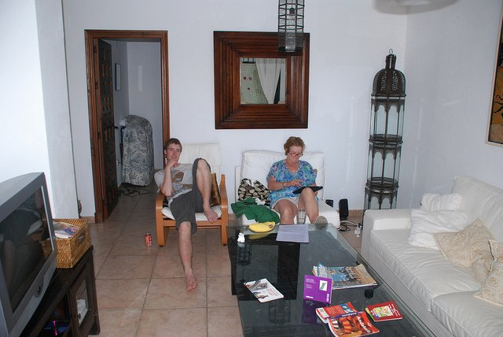
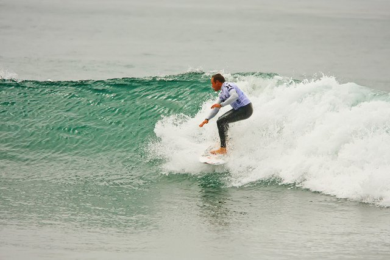
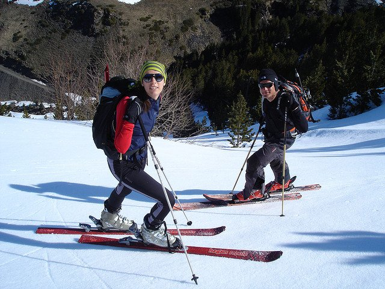
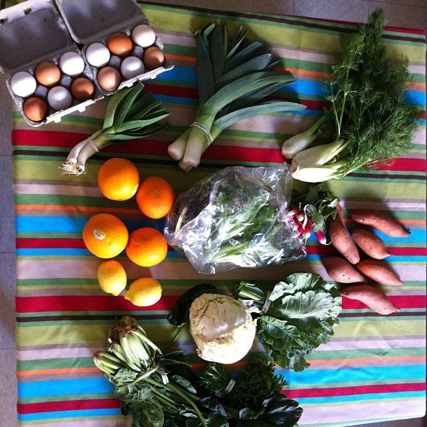
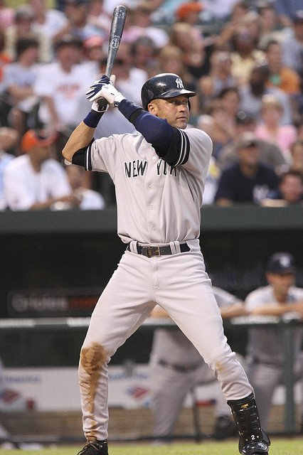
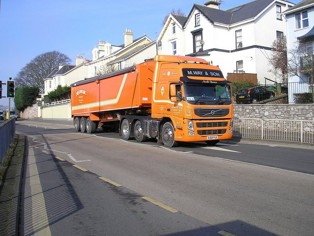

# ImageCaptioning
 

Using MS-COCO dataset.

Used <a href="https://keras.io/">Keras</a> with <a href="https://www.tensorflow.org/">Tensorflow</a> backend for the code. **InceptionV3** is used for extracting the features.

I am using Beam search with **k = 3, 5, 7** and an Argmax search for predicting the captions of the images.

The loss value of **1.64** has been achieved which gives good results. You can check out some examples below. The rest of the examples are in the jupyter notebook. You can run the Jupyter Notebook and try out your own examples. *word_tokenize.pkl* is a pickle file which contains all the unique words in the vocabulary. 

Everything is implemented in the Jupyter notebook which will hopefully make it easier to understand the code.

You can use the weights in the folder
# Examples

**a group of people sitting next to each other in a living room**

**a man riding a wave on top of a surfboard**

**a couple of people that are standing in the snow**

**a bunch of different types of vegetables on a table**

**a baseball player getting ready to hit a ball**

**there is a truck that is parked on the side of the road**
### Results
This model was trained solely on the COCO train2014 data. It achieves the following BLEU scores on the COCO val2014 data (with `beam size=1`):
* **BLEU-1 = 70.16%**
* **BLEU-2 = 51.98%**
* **BLEU-3 = 41.18%**
* **BLEU-4 = 27.6%**
* **ROUGE-L = 44.47%**
# Dependencies

* Keras 1.2.2
* Tensorflow 0.12.1
* tqdm
* numpy
* pandas
* matplotlib
* pickle
* PIL

# References

[1] M. Hodosh, P. Young and J. Hockenmaier (2013) "Framing Image Description as a Ranking Task: Data, Models and Evaluation Metrics", Journal of Artificial Intelligence Research, Volume 47, pages 853-899 <a href="http://www.jair.org/papers/paper3994.html">http://www.jair.org/papers/paper3994.html</a> 

[2] Oriol Vinyals, Alexander Toshev, Samy Bengio, Dumitru Erhan <a href="https://arxiv.org/abs/1411.4555">Show and Tell: A Neural Image Caption Generator</a>

[3] CS231n Winter 2016 Lesson 10 Recurrent Neural Networks, Image Captioning and LSTM <a href="https://youtu.be/cO0a0QYmFm8?t=32m25s">https://youtu.be/cO0a0QYmFm8?t=32m25s</a> 
